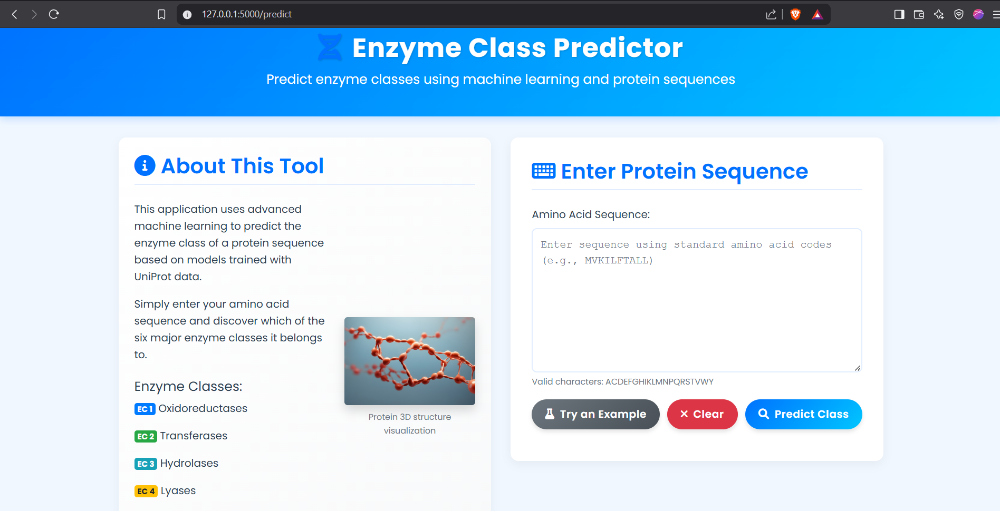
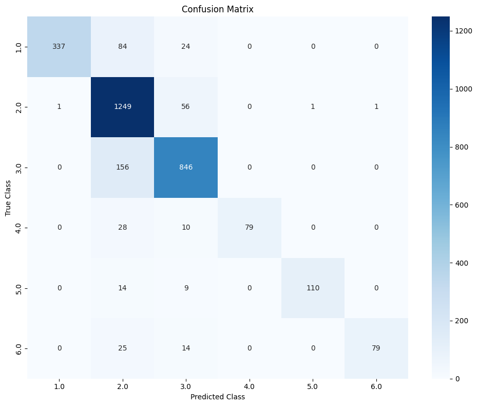
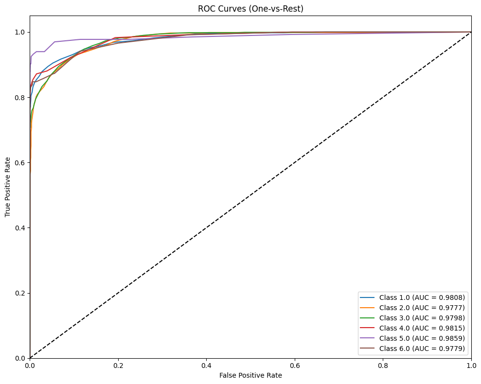
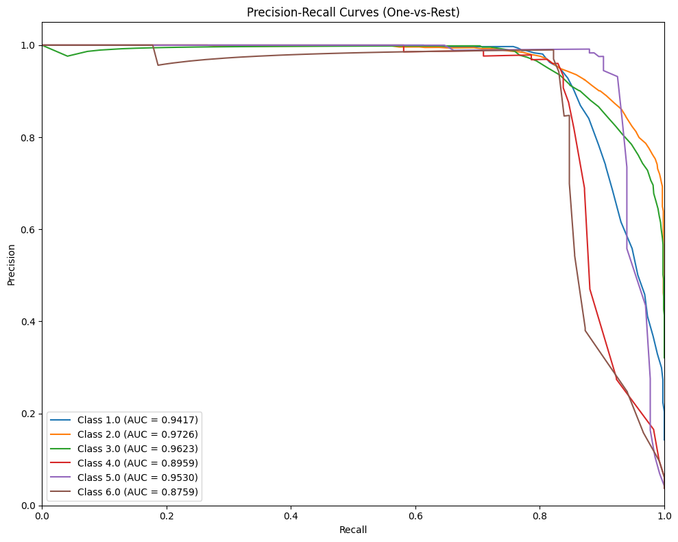
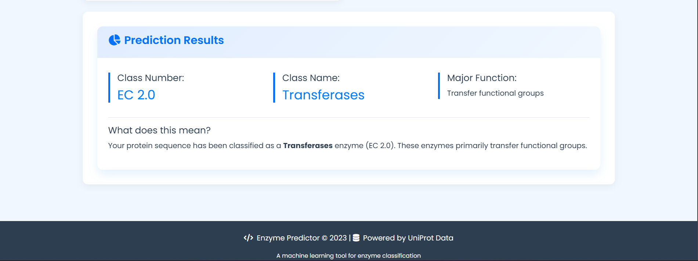

# 🧬 Enzyme Classification Model

> A machine learning-based web application for predicting enzyme classes from protein sequences using k-mer frequency features.


<p align="center">
  
</p>

## 📑 Overview

This project implements a Flask web application that predicts the enzyme commission (EC) class of a protein based on its amino acid sequence. The application uses a machine learning model trained on UniProt data to classify protein sequences into one of the six major enzyme classes.

## 🔍 Features

- ✅ Simple web interface for submitting protein sequences
- ✅ Machine learning prediction of enzyme class (EC 1-6)
- ✅ Detailed information about enzyme class functions
- ✅ Input validation for protein sequences
- ✅ Example sequences for testing

## 📂 Repository Structure

```
├── App
│   ├── app.py                       # Flask application
│   ├── static                       # Static assets
│   │   ├── app_screenshot.png
│   │   ├── confusion_matrix.png
│   │   ├── roc_curves.png
|   |   ├── prediction.png
│   │   ├── pr_curves.png
│   │   ├── protein.jpg
│   │   └── styles.css
│   └── templates
│       └── index.html               # Web interface
├── Data
│   └── Enzyme Data.tsv              # Training dataset
├── Docs
│   └── THEORY.pdf                   # Documentation
├── Environment
│   ├── INSTALLATION.pdf             # Setup instructions
│   └── environment.yml              # Conda environment
├── Model
│   ├── model.pkl                    # Trained classifier
│   └── vectorizer.pkl               # Feature extractor
├── README.md
└── bin
    └── model.ipynb                  # Training notebook
```

## 🔬 Enzyme Classes

The model predicts proteins into one of six major enzyme classes:

| Class | Name | Function |
|-------|------|----------|
| **EC 1** | **Oxidoreductases** | Catalyze oxidation-reduction reactions |
| **EC 2** | **Transferases** | Transfer functional groups from one molecule to another |
| **EC 3** | **Hydrolases** | Catalyze the hydrolysis of various bonds |
| **EC 4** | **Lyases** | Catalyze the breaking of bonds by means other than hydrolysis and oxidation |
| **EC 5** | **Isomerases** | Catalyze isomerization changes within a single molecule |
| **EC 6** | **Ligases** | Join two molecules with covalent bonds |

## 📊 Model Performance

The model was trained on an expanded dataset of protein sequences from UniProt, with the following performance metrics:

### Overall Metrics

<p align="center">

| Metric | Score |
|:------:|:-----:|
| **Accuracy** | **86.5%** |
| **Macro Precision** | **94.3%** |
| **Macro Recall** | **78.8%** |
| **Macro F1 Score** | **85.0%** |
| **Average ROC AUC** | **98.1%** |

</p>

### Class-specific Performance

<p align="center">

| Enzyme Class | Precision | Recall | F1 Score | ROC AUC | Support |
|:------------:|:---------:|:------:|:--------:|:-------:|:-------:|
| **EC 1** (Oxidoreductases) | 100.0% | 75.7% | 86.2% | 98.1% | 445 |
| **EC 2** (Transferases) | 80.3% | 95.5% | 87.2% | 97.8% | 1308 |
| **EC 3** (Hydrolases) | 88.3% | 84.4% | 86.3% | 98.0% | 1002 |
| **EC 4** (Lyases) | 100.0% | 67.5% | 80.6% | 98.2% | 117 |
| **EC 5** (Isomerases) | 99.1% | 82.7% | 90.2% | 98.6% | 133 |
| **EC 6** (Ligases) | 98.8% | 66.9% | 79.8% | 97.8% | 118 |

</p>

### Visualizations

<div align="center">
  <div style="display: flex; justify-content: space-between;">
    <div style="flex: 1; margin-right: 10px;">
      <h4>Confusion Matrix</h4>
      
    </div>
    <div style="flex: 1; margin-left: 10px;">
      <h4>ROC Curves</h4>
      
    </div>
  </div>
  <div style="margin-top: 20px;">
    <h4>Precision-Recall Curves</h4>
    
  </div>
</div>

## 🚀 Installation

### Prerequisites

- Conda (Anaconda or Miniconda)
- Git

### Setup

<details>
<summary>Click to expand setup instructions</summary>

1. Clone the repository:
```bash
git clone https://github.com/Karudhoru/Enzyme-Classification-Model.git
cd Enzyme-Classification-Model
```

2. Create the Conda Environment:
```bash
conda env create -f Environment/environment.yml
conda activate enzyme_classification
```

3. Update model paths in `app.py`:
```python
# Change these lines
model = joblib.load("D:/GIT/Enzyme Classification/Model/model.pkl")
vectorizer = joblib.load("D:/GIT/Enzyme Classification/Model/vectorizer.pkl")

# To these lines
model = joblib.load("Model/model.pkl")
vectorizer = joblib.load("Model/vectorizer.pkl")
```
</details>

## 📝 Usage

1. Start the application:
```bash
python app.py
```

2. Open your browser and navigate to:
```
http://127.0.0.1:5000/
```

3. Enter a protein sequence in the text area or click "Try an Example" to use a sample sequence.

4. Click "Predict" to get the enzyme class prediction.

## ⚙️ How It Works

### Model Training

The model was trained using the following approach:

1. **Data collection**: Protein sequences were collected from UniProt, with labels for their EC class
2. **Feature extraction**: Each protein sequence was converted to k-mer (tripeptide) frequency features
3. **Model selection**: Multiple classification algorithms were tested, including Random Forest, SVM, and Gradient Boosting
4. **Hyperparameter tuning**: Grid search was used to optimize model parameters
5. **Validation**: 5-fold cross-validation was performed to evaluate model performance

### Model Evaluation

<details>
<summary>Click to view evaluation code</summary>

```python
# Import required metrics from sklearn
from sklearn.metrics import accuracy_score, f1_score, confusion_matrix
from sklearn.metrics import precision_score, recall_score
from sklearn.metrics import classification_report, roc_auc_score, roc_curve
from sklearn.metrics import precision_recall_curve, average_precision_score, auc

# Calculate basic metrics
accuracy = accuracy_score(y_test, y_pred)
precision_macro = precision_score(y_test, y_pred, average='macro')
recall_macro = recall_score(y_test, y_pred, average='macro')
f1_macro = f1_score(y_test, y_pred, average='macro')

# Generate detailed classification report
class_report = classification_report(y_test, y_pred)

# Calculate ROC AUC for each class
# Generate visualizations for analysis
```
</details>

### Performance Analysis

The model shows excellent precision for most enzyme classes, but recall varies more significantly:

- **High Precision Classes**: EC 1, EC 4, EC 5, and EC 6 all have precision values above 98%
- **Balanced Classes**: EC 3 (Hydrolases) shows the most balanced performance between precision and recall
- **Class Imbalance**: The dataset contains significantly more examples of EC 2 and EC 3 classes
- **ROC Performance**: All classes show excellent ROC AUC scores above 97.8%, indicating strong discriminative ability

### Prediction Process

<p align="center">
  
</p>

## 👥 Contributing

Contributions are welcome! Please feel free to submit a Pull Request.

1. Fork the repository
2. Create your feature branch (`git checkout -b feature/amazing-feature`)
3. Commit your changes (`git commit -m 'Add some amazing feature'`)
4. Push to the branch (`git push origin feature/amazing-feature`)
5. Open a Pull Request

## 📫 Contact

Project Link: [https://github.com/Karudhoru/Enzyme-Classification-Model](https://github.com/Karudhoru/Enzyme-Classification-Model)

## 🙏 Acknowledgments

- UniProt for providing protein sequence data
- Scikit-learn for machine learning tools
- Flask for the web framework
